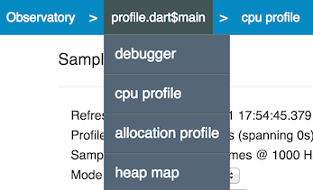

# Getting Started with Observatory
https://www.dartlang.org/tools/observatory/get-started.html


#### [Contents]
* Get Observatory
* Start Observatory
  * Standalone apps from the command line
  * Web apps
* Observatory UI
* VM screen
* What next?

```
ObservatoryはFreeでGETできます。
https://www.dartlang.org/downloads/ から取得できます。
issueやrequestは、 http://dartbug.com/new で受け付けています。
```

### Get Observatory
Observatory は Dart SDK 中の toolsのひとつです。https://www.dartlang.org/downloads/　からダウンロードできます。

Dartでアプリケーションをつくる場合2つの方法があります。 ひとつは、standalone applications として動作させる方法です。もうひとつは、web 

applications　として動作させる方法です。 standalone appsの場合、 command line から Observatory を使う事ができます。

browser-based apps の場合、command line からDartium 上でアプリを起動させる事で、Observatory を利用できます。

つまり、どちらの場合でもObservatoryを利用する事ができます。


### Start Observatory
standaloneか web appかによって、 Observatory 有効にする方法は異なります。
しかし、UIについてだいだい同じです。

##### Standalone apps from the command line

Observatoryを有効にするには、dartvm を起動する時にオプションを追加します。
例えば、
```
dart --observe <script>.dart
```

次に、お好みのブラウザーで http://localhost:8181 にアクセスしてください。Observatory UI　が表示されます。


デフォルトでは、このサービスは同コンピュータからのみ許可されています。
この制限は、ssdhでport foward するなどして回避することもできます。

```
ssh -L8181:127.0.0.1:8181 user@targetmachine
```

LinuxやMacを使っている場合は、IGQUITメッセージを送る事で、この機能を後から有効にすることもできます。Observatory UI へのアドレスは、コンソール上(STDOUT)に表示されます。

```
$ ps ax | grep dart
<pid> pts/61   Sl+    0:01 dart example.dart
$ kill -s SIGQUIT <pid>
Observatory listening on http://127.0.0.1:<port>
```

### Web apps
Dartium上でアプリを起動してください。例えば、WebStormで実行する場合は、index.htmlとかを右クリックして、pop-up menuからRunをを選択します。

Dartiumの中で、 select View > Developer > JavaScript ConsoleとしてCosoleを立ち上げると、以下のように表示されます。
```
Observatory listening on http://127.0.0.1:56246
```
このアドレスから、Observatory UI にアクセスできます。


コマンドラインから起動する事ものできます。より詳細な情報は、　https://www.dartlang.org/tools/dart-vm/#observatory を参照してください

* Mac OS:
```
cd <path-to-demo>/sunflower/web
<path-to-Dartium>/Chromium.app/Contents/MacOS/Chromium --DART_FLAGS="--steal_breakpoints --pause-isolates-on-start" sunflower.html
(#)kyorohiroの環境では、--DART_FLAGS="--steal_breakpoints --pause-isolates-on-start --observe --enable-vm-service --pause-isolates-on-exit"としました。
```


* Windows:
```
cd <path-to-demo>\sunflower\web
<path-to-Dartium>\Chromium\Application\chromium.exe --DART_FLAGS="--steal_breakpoints --pause-isolates-on-start" sunflower.html
```

* Linux:
```
cd <path-to-demo>/sunflower/web
<path-to-Dartium>/chromium-browser --DART_FLAGS="--steal_breakpoints --pause-isolates-on-start" sunflower.html
```


### Observatory UI
Observatory uses a browser-based UI—the UI is the same no matter how it is launched.

A solid blue bar appears at the top of most screens. The word Observatory is on the left. In some screens, a Refresh button is on the right. You can resample the information at any time using the Refresh button. There may also be other buttons on the right that are specific to a particular screen, such as the Clear button in the CPU Profile screen.


A breadcrumb trail, inside the blue bar, shows where you are in the Observatory UI. You can click items in the breadcrumb trail to navigate to other parts of the UI.

If you hover over the items in the breadcrumb bar, drop-down menus provide additional functionality for each screens. As shown in the following screenshot, hovering over the root isolate, profile.dart$main in this example, brings up a menu that includes debugger, cpu profile, allocation profile, and heap map.



You can return to the [VM screen](https://www.dartlang.org/tools/observatory/screens.html#vm-screen) at any time by clicking Observatory in the breadcrumb bar.

The next section describes the VM screen, Observatory’s landing page. For a comprehensive list of all screens, see [Screens in Observatory](https://www.dartlang.org/tools/observatory/screens.html).

### VM screen
