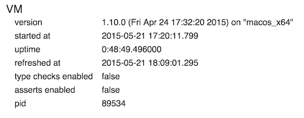
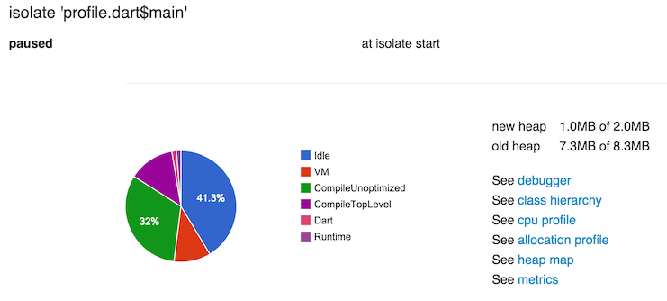

# Getting Started with Observatory

https://www.dartlang.org/tools/observatory/get-started.html
の訳


#### [Contents]
* Get Observatory
* Start Observatory
  * Standalone apps from the command line
  * Web apps
* Observatory UI
* VM screen
* What next?

```
ObservatoryはFreeでGETできます。
https://www.dartlang.org/downloads/ から取得できます。
issueやrequestは、 http://dartbug.com/new で受け付けています。
```

### Get Observatory
Observatory は Dart SDK 中の toolsのひとつです。https://www.dartlang.org/downloads/　からダウンロードできます。

Dartでアプリケーションをつくる場合2つの方法があります。 ひとつは、standalone applications として動作させる方法です。もうひとつは、web 

applications　として動作させる方法です。 standalone appsの場合、 command line から Observatory を使う事ができます。

browser-based apps の場合、command line からDartium 上でアプリを起動させる事で、Observatory を利用できます。

つまり、どちらの場合でもObservatoryを利用する事ができます。


### Start Observatory
standaloneか web appかによって、 Observatory 有効にする方法は異なります。
しかし、UIについてだいだい同じです。

##### Standalone apps from the command line

Observatoryを有効にするには、dartvm を起動する時にオプションを追加します。
例えば、
```
dart --observe <script>.dart
```

次に、お好みのブラウザーで http://localhost:8181 にアクセスしてください。Observatory UI　が表示されます。


デフォルトでは、このサービスは同コンピュータからのみ許可されています。
この制限は、ssdhでport foward するなどして回避することもできます。

```
ssh -L8181:127.0.0.1:8181 user@targetmachine
```

LinuxやMacを使っている場合は、IGQUITメッセージを送る事で、この機能を後から有効にすることもできます。Observatory UI へのアドレスは、コンソール上(STDOUT)に表示されます。

```
$ ps ax | grep dart
<pid> pts/61   Sl+    0:01 dart example.dart
$ kill -s SIGQUIT <pid>
Observatory listening on http://127.0.0.1:<port>
```

### Web apps
Dartium上でアプリを起動してください。例えば、WebStormで実行する場合は、index.htmlとかを右クリックして、pop-up menuからRunをを選択します。

Dartiumの中で、 select View > Developer > JavaScript ConsoleとしてCosoleを立ち上げると、以下のように表示されます。
```
Observatory listening on http://127.0.0.1:56246
```
このアドレスから、Observatory UI にアクセスできます。


コマンドラインから起動する事ものできます。より詳細な情報は、　https://www.dartlang.org/tools/dart-vm/#observatory を参照してください

* Mac OS:
```
cd <path-to-demo>/sunflower/web
<path-to-Dartium>/Chromium.app/Contents/MacOS/Chromium --DART_FLAGS="--steal_breakpoints --pause-isolates-on-start" sunflower.html
(#)kyorohiroの環境では、--DART_FLAGS="--steal_breakpoints --pause-isolates-on-start --observe --enable-vm-service --pause-isolates-on-exit"としました。
```


* Windows:
```
cd <path-to-demo>\sunflower\web
<path-to-Dartium>\Chromium\Application\chromium.exe --DART_FLAGS="--steal_breakpoints --pause-isolates-on-start" sunflower.html
```

* Linux:
```
cd <path-to-demo>/sunflower/web
<path-to-Dartium>/chromium-browser --DART_FLAGS="--steal_breakpoints --pause-isolates-on-start" sunflower.html
```


### Observatory UI
Observatory は browser-based で動作します。

上部に青色のパーが表示さけます。その左に文字が表示されます。リフレッシュボタンが右にあります。リフレッシボタンを押すと情報が更新されます。


blue bar の中には、 breadcrumb trail　がありす。これは、Observatory UI 上のどころいるかをしめしています。このItemをクリックすることができます。

このItem上にマウスカーソルを合わせると、drop-down menus が表示されます。
以下スクリーンショットのようになります。このスクリーンショットは、profile.dart$main 上にマウスカーソルを合わせたものです。 debugger, cpu profile, allocation profile, and heap map が表示されます。


breadcrumb bar を利用する事で、いつでも [VM screen](https://www.dartlang.org/tools/observatory/screens.html#vm-screen) に戻る事ができます。


次のSectionでは、VM Screenについて説明します。Observatoryで利用可能Screendについては、[Screens in Observatory](https://www.dartlang.org/tools/observatory/screens.html)を参照してください。


### VM screen
When you first connect to Observatory, it opens the VM screen, which reflects information available at the moment the app was sampled. For example:

To update the information, click the Refresh button in the upper right corner.

The displayed information includes:

##### version
When the VM was built and for which architecture.
##### started at
The time stamp when the VM was started.
##### uptime
How long the VM has been running.
##### refreshed at
When the data was last sampled.
##### type checks enabled
True if the VM is checking for type errors.
##### asserts enabled
True if assertion statements are evaluated by the VM.
##### pid
The process ID.

Below the VM information is a list of isolates. Every app has an initial isolate named <file>.dart$main.



For each isolate, a pie chart shows the breakdown of the activities of the VM. For more information on the meaning of these activities, see [User and VM Tags](https://www.dartlang.org/tools/observatory/tags.html).

A list of links take you to various Observatory screens. For more information, see [Screens in Observatory](https://www.dartlang.org/tools/observatory/screens.html).

Clicking the isolate’s name brings up an isolate screen, with detailed information about that isolate. For more information, see [Isolate](https://www.dartlang.org/tools/observatory/isolate.html).


### What next?