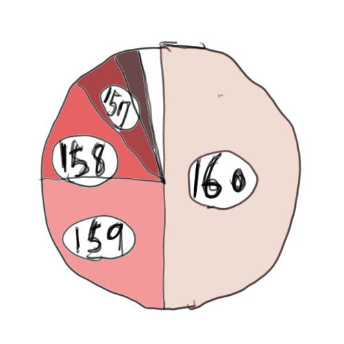

# FindNodeでネットワークを構築する
<hr>
* **FindNodeクエリでネットワークを構築する**
<br>
* **リスポンスを受けたらRootingTableを更新する**
<br>
<hr>

前章で、kBucketとRootingTableについては説明しました。このRootinhTableを更新しながら、実際にDHTのネットワークを組んでみましょう。


## FindNodeクエリでネットワークを構築する
Mainline DHT こと、KademliaではUDPを利用してPeerどうしが通信を行います。

DHRのネットワークを構築は、FindNodeクエリとFindNodeレスポンスのみで実現しています。

本章では、FindNodeクエリについて解説していきます。


### 指定したKIDに近い距離にあるPeerを紹介してもらう事ができる

FindNodeクエリを利用すると事で、指定したKIDともっとも距離が近いNodeを教えてもらう事ができます。

以下のようなBencodeで表現できます。
```
arguments:  
{
 "t":"aa",
 "y":"q",
 "q":"find_node", 
 "a":{
  "id" : "<nodes id>", 
  "target" : "<id of target node>"
 }
}

response: 
{
 "t":"aa",
 "y":"r",
 "r":{
  "id" : "<nodes id>",
  "nodes" : "<compact node info>"
 }
}
```

"t" は送信側が任意に決める事ができる値です。レスポンスには、送信時に指定した値が渡されます。この値を元にどのクエリのレスポンスかを判断する事がてきます。

"id"には、クエリを送信するPeerのKIDがして入ります。
"target"に指定したKIDと距離が近いPeerが帰りまする
"nodes" は、26byteのbyteデータの集まりで、20byteのPeer IDとIPとPort番号が格納されています。


### ネッワークへの参加/構築
ネットワークの構築はFindNodeクエリを利用します。我々は、自分に近いKIDを持つPeerについて詳しくなる必要があるのでした。


"id" に自分自信のPeer ID を指定して、 Node の一覧を取得します。 Rooting Table の中の上位 K個について、 FindNode を行います。この上位K個が固定されまで、 FindNod eを繰り返します。


なんども、この操作を繰り返しているうちに、DHT上でもっとも自分自信に近いPeerを発見できまます。

実際に1000個のPeerを生成して、試してみると以下の分布を得ることができました。 Kは8としました。

| Rooting Table index | Peerの数 | コメント |
| -- | -- | -- |
| 0 | 1 | 自分自信です|
| 147 | 1 |..|
| 154 | 1 |..|
| 155 | 4 |..|
| 156 | 4 |..|
| 157 | 6 |..|
| 158 | 8 |..|
| 159 | 8 |..|
| 160 | 8 |..| 


TorrentのDHTネットワークに接続した場合も同じような結果になります。自分自信に近いNodeは、Rooting Tabe index の、l130-150くらいのところに集まります。




実際にグラフに直してみると、150の付近で相当近くにあPeerである事がわかります。


ref http://www.bittorrent.org/beps/bep_0005.html

-------
Kyorohiro work

http://kyorohiro.strikingly.com
